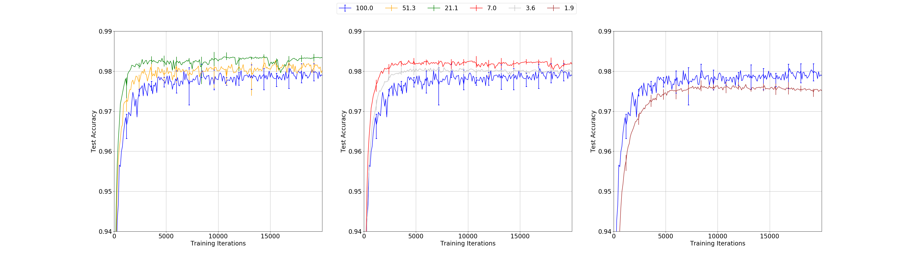
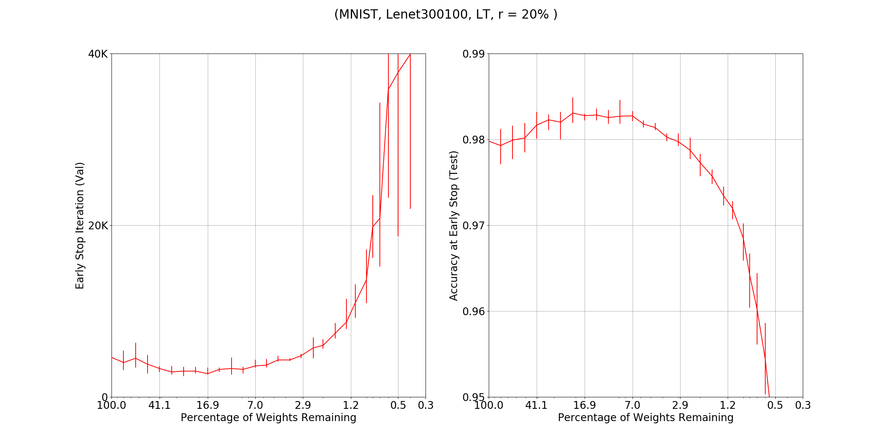

This is a pytorch implementation of the [lottery ticket hypothesis paper](https://arxiv.org/pdf/1803.03635.pdf). The main library is the [pruning package](https://pytorch.org/docs/stable/nn.html?highlight=pruning#torch.nn.utils.prune) added in version 1.4.  Although the plots look similar to those in the paper, they have been recomputed from scrach in plot_utils.py. 

The plots below are examples of the plots shown in the paper. The plots are for the Lenet300100 model on MNIST at 20% pruning rate. See plot_utils.py for details. 

The first plot is an example of the superior performs of the lottery tickets

This second plot is the early stop iteration and early stop test accuracy showing the early convergence of lottery tickets. 

